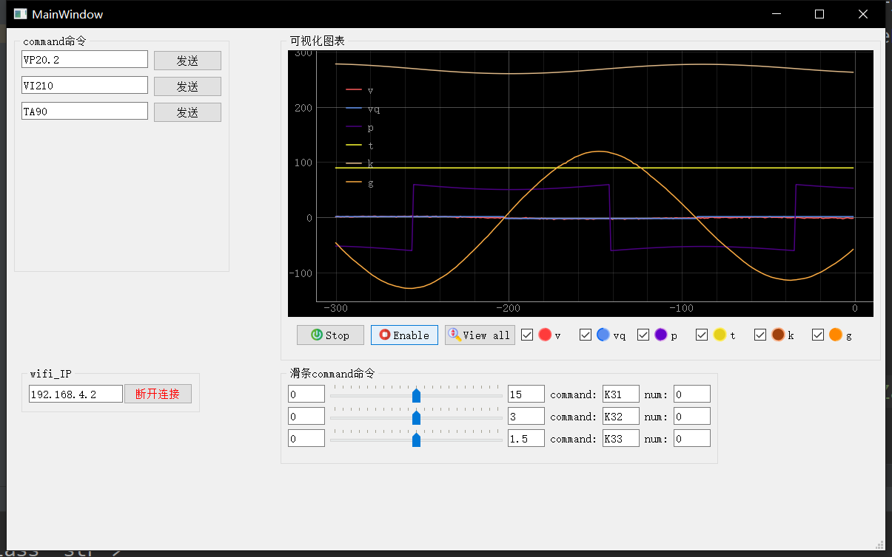

# 自平衡莱洛三角形可充电版

#### 介绍
**在B站[“基于LQR控制器的自平衡莱洛三角形”](https://www.bilibili.com/video/BV19v411n7mN)基础上添加了充电模块**
主控芯片使用ESP32，并配置了调参上位机，可以很方便的通过wifi无线调参。无刷控制使用灯哥开源FOC。制作出一个方便复刻的自平衡莱洛三角形，在桌面上作为一个摆件还是非常不错的[展示视频]()

#### 1 软件架构
在原作者的自平衡控制**电压**算法上进行修改，将电压控制改为**速度**控制。使对模型的控制在物理上更加容易理解。并且代码的调参都可以通过连接ESP32的wifi调整。具体特性如下：

- **基于 Arduino**：运行在 ESP32 Arduino 上
- **控制模式丰富**：电压控制和速度控制

#### 2 硬件特性

| 说明             | 参数     |
| ---------------- |---------------------- |
| 莱洛三角形尺寸             | 100*100 mm  |
|动量轮尺寸|80*80 mm|
| 输入电压         | 3.7v锂电池*3|
|充电电压| 5V 从Type-C口输入|
|充电芯片CS5095|5V输入,最大1.2A充电电流|
|串口芯片CH340C|需要打开开关才能下载|
| 主控             | ESP-WROOM-32           |
|电机驱动芯片L6234PD|引脚:32, 33, 25, 22; 22为enable|
|  AS5600 编码器 |SDA-23 SCL-5 |
| MPU6050六轴传感器  | SDA-19 SCL-18         |

#### 3 使用说明

1.  前往灯哥开源[FOCgit](https://gitee.com/ream_d/Deng-s-foc-controller)下载Arduino开发环境（~~也可自行下载Arduino并安装SimpleFOC~~）并打开本项目内的Arduino内的main，烧录程序到ESP32。
2.  打开本项目内的python_gui内的FOC_gui.exe并连接上WIFI：ESP32。点击设置开始调参。

比如让平衡角度为90度，则输入：TA90，并且会存入eeprom的位置0中 注：wifi发送**命令不能过快**，因为每次都会保存进eeprom，K参数没有保存到EEPROM所以可以使用滑条调整。

|   参数命令           | 说明    |
| ---------------- |---------------------- |
| TA | target_angle平衡角度 例如TA89.3 设置平衡角度89.3| 
| SV | swing_up_voltage摇摆电压 左右摇摆的电压，越大越快到平衡态，但是过大会翻过头|
|SA|swing_up_angle摇摆角度 离平衡角度还有几度时候，切换到自平衡控制|
|VP1|速度环的PID的P，1是稳定在平衡角度之前的P值|
|VI1|速度环的PID的I，1是稳定在平衡角度之前的I值|
|VP2|速度环的PID的P，2是稳定后的P值|
|VI2|速度环的PID的I，2是稳定后的I值|
|K**1**1|**1和2**是电压控制时参数。LQR的参数1*角度差值|
|K**1**2|**1和2**是电压控制时参数。LQR的参数2*左右倾倒加速度|
|K**1**3|**1和2**是电压控制时参数，**3和4**是速度控制时参数。LQR的参数3*当前速度|

#### 4 硬件设计
使用立创EDA绘制电路原理图，LaserMaker绘制莱洛三角形和动量轮（有激光切割机可以事先切割结构作为参考）。将绘制完的图形导入到立创EDA中可作为PCB的外框。丝印图案分别是**Gawr Gura**、**ouro kronii** ~~helicopter~~

LaserMaker绘制的plt在**莱洛三角结构**文件夹内

感谢嘉立创的PCB制板，使DIY电路制作变得非常便利

[莱洛三角形PCB](https://lceda.cn/45coll/zi-ping-heng-di-lai-luo-san-jiao_10-10-ban-ben)
[动量轮]()

具体需要购买的物品在**物料清单.xlsx**中

#### 5 Ctrl+C +V（参考）
Arduino上的控制算法抄的是原作者的LQR，无刷电机控制是抄灯哥开源的。电机控制引脚定义与传感器定义和灯哥开源FOC控制板2.0版完全一样。

Python的GUI是抄SimpleFOC的SimpleFOCStudio。

充电电路完全抄的是立创广场开源的CS5095充电方案。
1.  原作者：基于LQR控制器的自平衡莱洛三角形[BV19v411n7mN](https://www.bilibili.com/video/BV19v411n7mN)
2.  灯哥开源FOC [https://gitee.com/ream_d/Deng-s-foc-controller](https://gitee.com/ream_d/Deng-s-foc-controller)
3.  充电芯片电路[https://oshwhub.com/Aknice/cs5095e-san-jie-li-dian-chi-sheng-ya-chong-dian-dian-lu](https://oshwhub.com/Aknice/cs5095e-san-jie-li-dian-chi-sheng-ya-chong-dian-dian-lu)

#### 6 有用的地方

1.  Arduino的程序中的command.h、command.cpp可以支持任意的字符串输入。在其他项目中一样可以用，无论是wifi接收到的字符串数据或者是串口的字符串数据。

2. GUI上位机可以在其他wifi项目中可以继续使用，用来调参还是很方便。