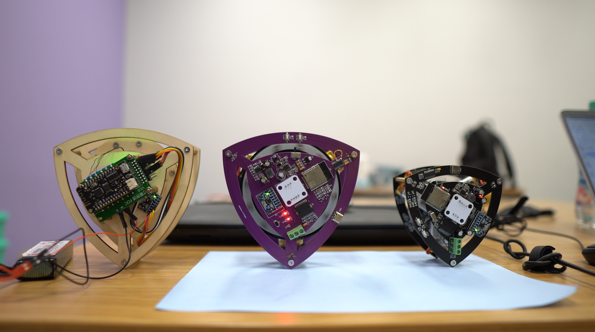

# 自平衡莱洛三角形可充电版

#### 介绍
**在B站[“基于LQR控制器的自平衡莱洛三角形”](https://www.bilibili.com/video/BV19v411n7mN)基础上添加了充电模块**
主控芯片使用ESP32，并配置了调参上位机，可以很方便的通过wifi无线调参。无刷控制使用灯哥开源FOC。制作出一个方便复刻的自平衡莱洛三角形，在桌面上作为一个摆件还是非常不错的
[展示视频](https://www.bilibili.com/video/BV1b3411x7za)

左：使用灯哥开源FOC2.0板测试

中：13*13cm立创紫PCB

右：10*10cm最终版本
#### 1 软件架构
在原作者的自平衡控制**电压**算法上进行修改，将电压控制改为**速度**控制。使对模型的控制在物理上更加容易理解。并且代码的调参都可以通过连接ESP32的wifi调整。具体特性如下：

- **基于 Arduino**：运行在 ESP32 Arduino 上
- **控制模式丰富**：电压控制和速度控制

#### 2 硬件特性

| 说明             | 参数     |
| ---------------- |---------------------- |
| 莱洛三角形尺寸             | 100*100 mm  |
|动量轮尺寸|80*80 mm|
|电池*3 |厚x长x宽:7.9mmx25mmx40mm|
| 输入电压         | 3.7v锂电池*3|
|充电电压| 5V 从Type-C口输入|
|充电芯片CS5095|5V输入,最大1.2A充电电流|
|串口芯片CH340C|需要打开开关才能下载|
| 主控芯片             | ESP-WROOM-32           |
|电机驱动芯片L6234PD|引脚:32, 33, 25, 22; 22为enable|
|  AS5600 编码器 |SDA-23 SCL-5 芯片要离磁铁有2mm以上高度|
| MPU6050六轴传感器  | SDA-19 SCL-18         |

#### 3 使用说明

1. 前往灯哥开源[FOCgit](https://gitee.com/ream_d/Deng-s-foc-controller)下载Arduino开发环境（~~也可自行下载Arduino并安装SimpleFOC~~）并打开本项目内的Arduino内的main。
2. 烧录程序到ESP32：选择工具-开发板-esp32 Arduino-ESP32 Dev module，然后连接USB口选择对应的com口，编译上传。
   1. 如无法正常编译
      1. 情况1：wifi库重复，删除文件夹Arduino\libraries内的wifi文件夹。
      2. 情况2：可能与原有arduino冲突，请卸载原有的arduino。
3. 打开本项目内的`python_gui`内的`可执行文件_main`内的**main.exe**并连接上WIFI：ESP32。点击设置开始调参。

4. K值可以用滑块调整，拖动滑块就会发送参数命令，但是调整到合适值之后需要自行在Arduino的main中修改再烧录一次

5. 滑条：最左边输入框为滑块下限，右边是滑块上限，滑条等分成**200**份，命令是**字符串**，滑动滑块发送**字符串** + **数值**

比如让平衡角度为90度，则输入：TA90，并且会存入eeprom的位置0中 注：wifi发送**命令不能过快**，因为每次都会保存进eeprom，K参数没有保存到EEPROM所以可以使用滑条调整。

|   参数命令           | 说明    |
| ---------------- |---------------------- |
| TA | target_angle平衡角度 例如TA89.3 设置平衡角度89.3| 
| SV | swing_up_voltage摇摆电压 左右摇摆的电压，越大越快到平衡态，但是过大会翻过头|
|SA|swing_up_angle摇摆角度 离平衡角度还有几度时候，切换到自平衡控制|
|VP1|速度环的PID的P，1是稳定在平衡角度之前的P值|
|VI1|速度环的PID的I，1是稳定在平衡角度之前的I值|
|VP2|速度环的PID的P，2是稳定后的P值|
|VI2|速度环的PID的I，2是稳定后的I值|
|K为LQR参数|第一个数字**1和2**是电压控制稳定前和后**3和4**是速度控制稳定前和后，第二个数字如下|
|K1**1**|LQR的参数1：角度差值|
|K1**2**|LQR的参数2：左右倾倒加速度|
|K1**3**|LQR的参数3：当前速度|

LQR算法解释：当三角形向←倾斜时，需要产生向→的力回正。

在电压控制下：回正力F直接和输出电压值挂钩，向←倾斜，电机提供正电压V动量轮向**左加速转动**，产生向右的力F。

`期望电压 = 角度差值x参数1 + 左右倾倒加速度x参数2 + 当前速度x参数3`

在速度控制下：回正力F和动量轮转速加速度a有关，F = ma，向←倾斜，电机需要向**左加速转动**，产生向右的力F。

`期望速度 = 角度差值x参数1 + 左右倾倒加速度x参数2 + 当前速度x参数3`

两者区别：电压和速度控制都可以实现平衡，但因为使用simpleFOC控制电机转速无法无限加速，本电机实验最高转速180转，电压到上限12v。

使用电压控制会遇到，电机一下子就到了转速上限，就不能提供稳定的力F，参数调起来比较困难。

速度控制可以在偏差变大的时候，根据期望速度产生最大电压12v，并且不会超过电机最高转速。
#### 4 硬件设计
使用立创EDA绘制电路原理图，LaserMaker绘制莱洛三角形和动量轮（有激光切割机可以事先切割结构作为参考）。将绘制完的图形导入到立创EDA中可作为PCB的外框。丝印图案分别是**Gawr Gura**、**ouro kronii** ~~helicopter~~

LaserMaker绘制的plt在**莱洛三角结构**文件夹内

感谢嘉立创的PCB制板，使DIY电路制作变得非常便利

[莱洛三角形PCB](https://oshwhub.com/45coll/zi-ping-heng-di-lai-luo-san-jiao_10-10-ban-ben)

[动量轮](https://oshwhub.com/45coll/lai-luo-san-jiao-dong-liang-lun)

具体需要购买的物品在**物料清单.xlsx**中

#### 5 Ctrl+C +V（参考）
Arduino上的控制算法是原作者的LQR，无刷电机控制是灯哥开源FOC。电机控制引脚定义与传感器定义和灯哥开源FOC控制板2.0版一样。

Python的GUI是SimpleFOC的SimpleFOCStudio。

充电电路是立创广场开源的CS5095充电方案。
1.  原作者：基于LQR控制器的自平衡莱洛三角形[BV19v411n7mN](https://www.bilibili.com/video/BV19v411n7mN)
2.  灯哥开源FOC [https://gitee.com/ream_d/Deng-s-foc-controller](https://gitee.com/ream_d/Deng-s-foc-controller)
3.  充电芯片电路[https://oshwhub.com/Aknice/cs5095e-san-jie-li-dian-chi-sheng-ya-chong-dian-dian-lu](https://oshwhub.com/Aknice/cs5095e-san-jie-li-dian-chi-sheng-ya-chong-dian-dian-lu)

#### 6 有用的地方

1. Arduino的程序中的command.h、command.cpp可以支持任意的字符串输入。在其他项目中一样可以用，无论是wifi接收到的字符串数据或者是串口的字符串数据。

2. GUI上位机可以在其他wifi项目中可以继续使用，用来调参还是很方便。

#### 7 未解之谜

问题1：在传感器读取当前角度pitch在0和360来回切换时候，卡尔曼滤波值会慢慢变化，得到的值无法反映正确的当前角度。导致有一个面无法摇摆平衡。

问题2：摇摆到平衡态时，参数不太好时，可能会摇摆过头，或者一直左右摇摆不能到平衡态。就算调好参数也会偶尔发生摇摆过头现象。

#### 8 交流Q群

45coll电子交流QQ群：**824113552**

欢迎交流与沟通
